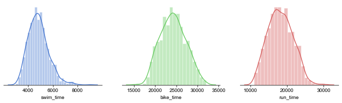
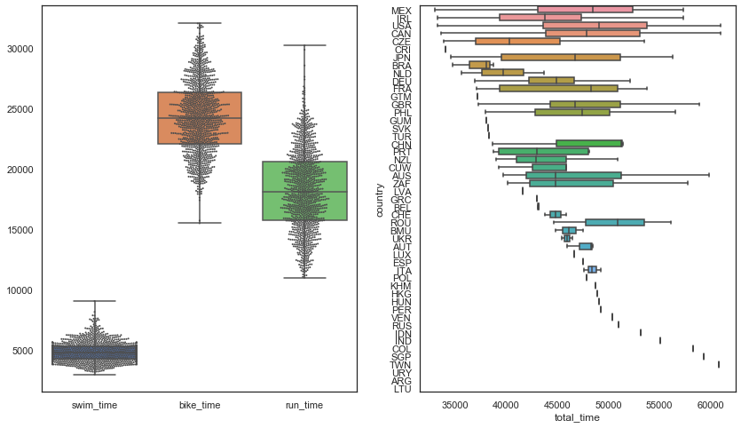
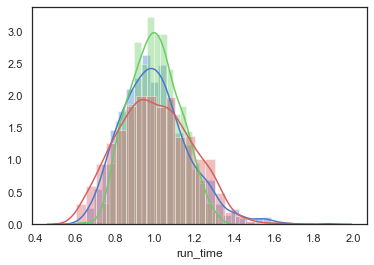
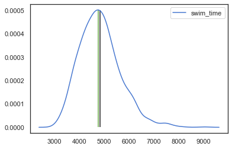
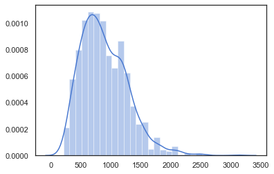

I have created a web-scraping tool to pull athlete result data from Ironman triathlon events. Using some of this data I'd like to do some simple analysis on the relative distances and finishing times of the three disciplines in triathlon: swim, bike run. In the end, I would like to come up with a 'natural' distance for each disciplines, where each is equally weighted in the event.

## A brief look at finishing times

Using the associated Ironman data-scrapper, the event data for Ironman Canada 2019 (held in Mt. Tremblant) will be used for demonstration. We can see the general structure of the data below. The data pulled from the Ironman site is athlete-specific and quite granular, including all split times and ranks for each individual.


```python
import pandas as pd
import time

event_folder = 'data/canada140/'
ad = pd.read_csv(event_folder+'data.csv')
ad.head()
```


<div>
<style scoped>
    .dataframe tbody tr th:only-of-type {
        vertical-align: middle;
    }

    .dataframe tbody tr th {
        vertical-align: top;
    }

    .dataframe thead th {
        text-align: right;
    }
</style>
<div style="overflow-x:auto;">
<table border="1" class="dataframe">
  <thead>
    <tr style="text-align: right;">
      <th></th>
      <th>link</th>
      <th>name</th>
      <th>bib</th>
      <th>division</th>
      <th>age</th>
      <th>state</th>
      <th>country</th>
      <th>profession</th>
      <th>points</th>
      <th>overall_rank</th>
      <th>...</th>
      <th>gender_rank</th>
      <th>swim_time</th>
      <th>bike_time</th>
      <th>run_time</th>
      <th>total_time</th>
      <th>swim_racetime</th>
      <th>bike_racetime</th>
      <th>run_racetime</th>
      <th>t1_time</th>
      <th>t2_time</th>
    </tr>
  </thead>
  <tbody>
    <tr>
      <td>0</td>
      <td>https://www.ironman.com/triathlon/events/ameri...</td>
      <td>Raynard Picard</td>
      <td>139</td>
      <td>35-39</td>
      <td>39</td>
      <td>CA</td>
      <td>MEX</td>
      <td>---</td>
      <td>5000</td>
      <td>1.0</td>
      <td>...</td>
      <td>1.0</td>
      <td>3577.0</td>
      <td>17389.0</td>
      <td>11612.0</td>
      <td>32966.0</td>
      <td>3577.0</td>
      <td>21193.0</td>
      <td>32966.0</td>
      <td>227.0</td>
      <td>161.0</td>
    </tr>
    <tr>
      <td>1</td>
      <td>https://www.ironman.com/triathlon/events/ameri...</td>
      <td>James Curran</td>
      <td>211</td>
      <td>35-39</td>
      <td>34</td>
      <td>Munster</td>
      <td>IRL</td>
      <td>---</td>
      <td>4948</td>
      <td>2.0</td>
      <td>...</td>
      <td>2.0</td>
      <td>3820.0</td>
      <td>17904.0</td>
      <td>11172.0</td>
      <td>33224.0</td>
      <td>3820.0</td>
      <td>21907.0</td>
      <td>33224.0</td>
      <td>183.0</td>
      <td>145.0</td>
    </tr>
    <tr>
      <td>2</td>
      <td>https://www.ironman.com/triathlon/events/ameri...</td>
      <td>Reid Foster</td>
      <td>130</td>
      <td>30-34</td>
      <td>33</td>
      <td>OK</td>
      <td>USA</td>
      <td>---</td>
      <td>5000</td>
      <td>3.0</td>
      <td>...</td>
      <td>3.0</td>
      <td>3437.0</td>
      <td>17605.0</td>
      <td>11834.0</td>
      <td>33242.0</td>
      <td>3437.0</td>
      <td>21238.0</td>
      <td>33242.0</td>
      <td>196.0</td>
      <td>170.0</td>
    </tr>
    <tr>
      <td>3</td>
      <td>https://www.ironman.com/triathlon/events/ameri...</td>
      <td>Heather Wurtele</td>
      <td>3</td>
      <td>PRO</td>
      <td>40</td>
      <td>BC</td>
      <td>CAN</td>
      <td>---</td>
      <td>5000</td>
      <td>4.0</td>
      <td>...</td>
      <td>1.0</td>
      <td>3198.0</td>
      <td>18107.0</td>
      <td>12084.0</td>
      <td>33641.0</td>
      <td>3198.0</td>
      <td>21429.0</td>
      <td>33641.0</td>
      <td>124.0</td>
      <td>128.0</td>
    </tr>
    <tr>
      <td>4</td>
      <td>https://www.ironman.com/triathlon/events/ameri...</td>
      <td>Karel Sumbal</td>
      <td>145</td>
      <td>40-44</td>
      <td>42</td>
      <td>SC</td>
      <td>CZE</td>
      <td>---</td>
      <td>5000</td>
      <td>5.0</td>
      <td>...</td>
      <td>4.0</td>
      <td>3510.0</td>
      <td>19025.0</td>
      <td>11043.0</td>
      <td>33913.0</td>
      <td>3510.0</td>
      <td>22730.0</td>
      <td>33913.0</td>
      <td>195.0</td>
      <td>140.0</td>
    </tr>
  </tbody>
</table>
</div>
<p>5 rows × 21 columns</p>
</div>


```python
print('There are {:d} athlete entries.'.format(len(ad.index)))
```

    There are 1489 athlete entries.


Each athlete entry (row) includes a direct link to it's results page, along with detailed race data. All time-based columns are in units of seconds. First, let's look at the finishing times of all the athletes.


```python
import matplotlib.pyplot as plt
import seaborn as sns
import numpy as np

sns.distplot(ad.total_time.dropna())
```


    <matplotlib.axes._subplots.AxesSubplot at 0x18208617d0>


Notice the irregular distribution shape and the truncation for long time. This is atleast partially due to the hard time limit of the event (17hrs or 61200s). Additionally, each dicipline has it own cut-off time.


```python
print('The average and median total times are ' + time.strftime('%Hhrs %Mmin %Ss', time.gmtime(np.mean(ad.total_time))) +
     ' and '+ time.strftime('%Hhrs %Mmin %Ss', time.gmtime(np.median(ad.total_time.dropna()))) +
     '. The standard deviation of the distribution is ' +time.strftime('%Hhrs %Mmin %Ss', time.gmtime(np.std(ad.total_time))) + '.') 
```

    The average and median total times are 13hrs 21min 41s and 13hrs 23min 51s. The standard deviation of the distribution is 01hrs 46min 57s.


```python
f, ax = plt.subplots(1,3,figsize=(12, 3))
plt.setp(ax, yticks=[])
sns.set(style="white", palette="muted", color_codes=True)
sns.despine(left=True)
sns.distplot(ad.swim_time.dropna(), color='b',ax=ax[0])
sns.distplot(ad.bike_time.dropna(), color='g',ax=ax[1])
sns.distplot(ad.run_time.dropna(), color='r',ax=ax[2])
```


    <matplotlib.axes._subplots.AxesSubplot at 0x1a214a4210>





The event cut-off times for the swim, bike, and run are 2hrs 20min (8400s), 8hrs 10min (29400s), and 6hrs 30min (23400s) respectively. Some individual times may exceed this limit, but the athlete would not be permitted to continue to the next dicipline.


```python
print([(np.mean(time), np.median(time.dropna()), np.std(time), np.std(time)/np.mean(time)) for time in [ad.swim_time,ad.bike_time,ad.run_time]])
```

    [(4839.948738812042, 4765.0, 823.7251282290428, 0.17019294473586197), (24268.259509721047, 24194.0, 3001.649341671252, 0.12368622234606039), (18234.61800699301, 18085.5, 3351.7988083726937, 0.18381513706990038)]


An interesting feature of the plots above is that while the swim times produce the narrowest distribution, they are not the least variable with respect to the mean. The swim time standard deviation is 17.0% of the average swim time, compared to 12.4% for the bike, and 18.4% for the run. The run result at least is expected, since it is the last dicipline of a gruelling event. With the body exhausted it is natural to expect significant variability in finishing times.


```python
f, ax = plt.subplots(1,2,figsize=(14, 8))
sns.swarmplot(data=ad.iloc[:,12:15],size=2, color=".3", linewidth=0, ax=ax[0])
sns.boxplot(data=ad.iloc[:,12:15], whis="range", ax=ax[0])
sns.boxplot(x='total_time', y='country', data=ad, ax=ax[1])
```




### A natural triathlon distance

The Ironman triathlon, sometimes referred to as a 140.6, consists of a 3.86km swim, 180.25km bike, and 42.20km run. Added together the event is 226.3km, or 140.6 miles (hence the name). As shown above, the bike portion of the race is heavily weighted, averaging for more than half the total race time. While one could contemplate and debate the merits of this with respect to the sport of triathlon, I am curious what a more evenly weighted race looks like. Presumably there would be less emphasis on the bike, likely being shifted to the swim - but to what extent? 

The total event distance $d_{event}$ is simply the sum of the dicipline distances:
$$
d_{event} = d_{swim} + d_{bike} + d_{run}
$$


```python
d_ims = 3.86; d_imb = 180.25; d_imr = 42.2; d_im = d_ims + d_imb + d_imr
```

### Weighting schemes for dicipline distances
For the purposes of this analysis we will hold the total event distance constant ($d_{event} = D_T = 226.3 km$). This leaves us to choose conditions for the weighting of each dicipline. We will investigate a few weighting schemes now. In each case, the dicipline distance is characterized by it weight, $W_i$:
$$
d_i = W_iD_{T}
$$
The weights must be normalized, therefore:
$$
\sum W_i = 1
$$

The Ironman 140.3 uses relative distances of 1:46.7:10.9 for $d_{swim}:d_{bike}:d_{run}$, resulting in weights of: 0.017, 0.796, and 0.186.

#### Equal weighting
A simple scheme is to simply weight all diciplines equally:
$$
W_i = \frac{1}{N} = \frac{1}{3}.
$$
The resulting dicipline distance is $226.3/3 = 75.4 km$. 


```python
w_s = w_b = w_r = 1/3
print('The dicipline distances are swim = {:.1f}km, bike = {:.1f}km, run = {:.1f}km.'.format(*[w*d_im for w in [w_s,w_b,w_r]]))
```

    The dicipline distances are swim = 75.4km, bike = 75.4km, run = 75.4km.


This is a trivially absurd example considering a 'marathon' swim is typically expressed as $10 km$, i.e. the event would consist of 8 consecutive marathon swim, capped by two marathon runs. Meanwhile, the bike distance is nothing a a casual Sunday rider couldn't handle. While this example is silly, it does suggest the next weighting scheme: time-weighted distances.

#### Time weighting
Time (or speed) weighting may be the first 'natural' choice for determining dicipline distances. The premise is that each dicipline should take roughly the same amount of time to complete. On an individual basis this almost certainly will not hold true, but if instead we consider the entire field we can determine a weighting scheme that will satisfy the equal-time criterion.

Once again, we are using the Ironman Canada 2019 data as a test-case. The mean split swim/bike/run times in this event were:


```python
print('{:.2f}, {:.2f}, {:.2f} hours, respectively.'.format(*[np.mean(time)/(60*60) for time in [ad.swim_time,ad.bike_time,ad.run_time]]))
```

    1.34, 6.74, 5.07 hours, respectively.


The average split time for each dicipline is given simply by $t_i = \frac{d_i}{v_i}$, where $v_i$ is the average speed for the split. Since $d_i = W_i D_{T}$, the split time can be written as:
$$
t_i = \frac{W_i}{v_i}D_T
$$
and the dicipline weights written as:
$$
W_i = \frac{v_i t_i}{D_T}.
$$

If we enforce the condition that split times must be equal, $t_i = t_{swim} = t_{bike} = t_{run} = T$, then we see that, since $T$ and $D_T$ are constant, the weights are proportional to the average speed.

We can express the normalized weights, $W_i$, in a slightly different manner:
$$
W_i = \frac{w_i}{\sum w_i},
$$
where $w_i$ are unnormalized and the sum in the denominator serves as the normalization constant. Using this notation it is simple to see that in the case of equal-time weighting, $w_i=v_i$, and so:
$$
W_i = \frac{1}{\sum v_i}v_i.
$$
Evidently, the normalization constant is $\frac{1}{\sum v_i}=\frac{T}{D_T} = A$.

The average swim, bike, and run speeds (from IronmanCanada 2019) are:


```python
v = np.array([(x*1000)/(np.mean(time)) for (x,time) in zip([d_ims,d_imb,d_imr],[ad.swim_time,ad.bike_time,ad.run_time])])
print('{:.2f}, {:.2f}, {:.2f} m/s, respectively.'.format(*v))
```

    0.80, 7.43, 2.31 m/s, respectively.


```python
A = 1/np.sum(v)
W = A*v
d = d_im*W
t_e = 3*(A*1000)*d_im
print('Normalization A: {:.3f} s/m'.format(A))
print('Weights:\n\tSwim: {:.3f}\n\tBike: {:.3f}\n\tRun: {:.3f}'.format(*W))
print('Distances: {} km total\n\tSwim: {:.2f} km\n\tBike: {:.2f} km\n\tRun: {:.2f} km'.format(d_im,*d))
print('Total average time: {:.1f} hrs'.format(t_e/(60*60)))
```

    Normalization A: 0.095 s/m
    Weights:
    	Swim: 0.076
    	Bike: 0.705
    	Run: 0.220
    Distances: 226.31 km total
    	Swim: 17.13 km
    	Bike: 159.49 km
    	Run: 49.69 km
    Total average time: 17.9 hrs


The resulting dicipline distances for this time-weighted scheme are 17.1 km, 159.5 km, and 49.7 km, for the swim, bike, and run, respectively. Expressed as ratios this is 1:9.3:2.9. This leads to an average event time of 17.9 hrs. If we scale the event down to the current average finishing time (13hrs 21min 41s), the distances become: 


```python
t_im = np.mean(ad.total_time-(ad.t1_time+ad.t2_time))
C = t_im/t_e
d_scaled = C*d
d_e = d_im*C
print('Distances: {:.2f} km total\n\tSwim: {:.2f} km\n\tBike: {:.2f} km\n\tRun: {:.2f} km'.format(d_e,*d_scaled))
```

    Distances: 165.85 km total
    	Swim: 12.55 km
    	Bike: 116.88 km
    	Run: 36.42 km


These results are starting to look realistic. The swim, though more than four times the current Ironman distance, is only slightly longer than an Olympic marathon swim. While this on it's own isn't an issue, organizers may view (and rightly so) an average of 4+hrs in the water as a significant safety risk.

#### Equal-opportunity weighting

The time-weighted approached discussed previously foccuses on equalizing the time of each segment. On the surface, this may seems like the most fair option to specialists of each dicipline, i.e. a strong swimmer would have the same advantage as a strong runner. However, since the distribution of paces in each dicipline is not uniform, this is not true. This is highlighted by the normalized dicipline finishing times shown below:


```python
sns.distplot(ad.swim_time.dropna()/np.mean(ad.swim_time.dropna()), color='b')
sns.distplot(ad.bike_time.dropna()/np.mean(ad.bike_time.dropna()), color='g')
sns.distplot(ad.run_time.dropna()/np.mean(ad.run_time.dropna()), color='r')
```


    <matplotlib.axes._subplots.AxesSubplot at 0x1a21c72110>





Evidently, the bike is the most narrowly distributed segment, followed by the swim, then run. This means a relatively strong biker will gain less time, relatively (i.e. time_gained/time_total) than a relatively strong swimmer or runner. The equal-opportunity weighting scheme will assign distances such that the time gained/lost to the field by a given athelete is consistent accross all diciplines for atheletes of the same relative skill level.

Clearly, the distributions above are not perfectly Gaussian, but they are relatively normally distributed. They are (essentially) single-mode and not significantly asymmetric. The mean and median do not differ by more than 1.5% (swim). A reasonable proxy for the discipline variability is the standard deviation of the distribution.

$$
w_i = \frac{t_i}{\sigma_i}v_i = \frac{d_i}{\sigma_i}.
$$

The term $\frac{\sigma_i}{t_i}$ is the standard deviation of the distribution relative to the mean:


```python
print('Relative standard deviation\nSwim: {:.3f}\nBike: {:.3f}\nRun: {:.3f}'.format(*[np.std(time.dropna())/np.mean(time) for time in [ad.swim_time,ad.bike_time,ad.run_time]]))
```

    Relative standard deviation
    Swim: 0.170
    Bike: 0.124
    Run: 0.184


```python
w = np.array([dist/np.std(time.dropna()) for dist,time in zip([d_ims,d_imb,d_imr],[ad.swim_time,ad.bike_time,ad.run_time])])
A = 1/(sum(w))
W = A*w
d = d_im*W
t_e = np.sum((d*1000)/v)
print('Weights:\n\tSwim: {:.3f}\n\tBike: {:.3f}\n\tRun: {:.3f}'.format(*W))
print('Distances: {} km total\n\tSwim: {:.2f} km\n\tBike: {:.2f} km\n\tRun: {:.2f} km'.format(d_im,*d))
print('Total average time: {:.1f} hrs'.format(t_e/(60*60)))
```

    Weights:
    	Swim: 0.061
    	Bike: 0.777
    	Run: 0.163
    Distances: 226.31 km total
    	Swim: 13.71 km
    	Bike: 175.75 km
    	Run: 36.85 km
    Total average time: 15.8 hrs


Surprisingly, this treatment results in an increase of the swim distance at the expense of the run distance.

#### Time-gained weight

The strategy above can be treated more analytically. The time-gained in a dicipline is:
$$
t_g = t - t_0 = \frac{d_0}{v_0}-\frac{d_0}{v}
$$


```python
w = np.array([v0*(1-(np.mean(time)/np.std(time.dropna()))) for v0,time in zip(v,[ad.swim_time,ad.bike_time,ad.run_time])])
A = 1/(sum(w))
W = A*w
d = d_im*W
t_e = np.sum((d*1000)/v)
print('Weights:\n\tSwim: {:.3f}\n\tBike: {:.3f}\n\tRun: {:.3f}'.format(*W))
print('Distances: {} km total\n\tSwim: {:.2f} km\n\tBike: {:.2f} km\n\tRun: {:.2f} km'.format(d_im,*d))
print('Total average time: {:.1f} hrs'.format(t_e/(60*60)))
```

    Weights:
    	Swim: 0.058
    	Bike: 0.788
    	Run: 0.154
    Distances: 226.31 km total
    	Swim: 13.18 km
    	Bike: 178.31 km
    	Run: 34.82 km
    Total average time: 15.4 hrs


```python

```


```python
data = ad.swim_time.dropna()
kde = sns.kdeplot(data)
x,y = kde.get_lines()[0].get_data()
imax = np.argmax(y)
plt.vlines([x[imax],np.mean(data),np.median(data)],0,np.max(y), color=['r','k','g'])
```


    <matplotlib.collections.LineCollection at 0x1a21c23c50>





```python
sns.distplot((ad.t1_time+ad.t2_time).dropna())
```


    <matplotlib.axes._subplots.AxesSubplot at 0x1a21d8ac50>




