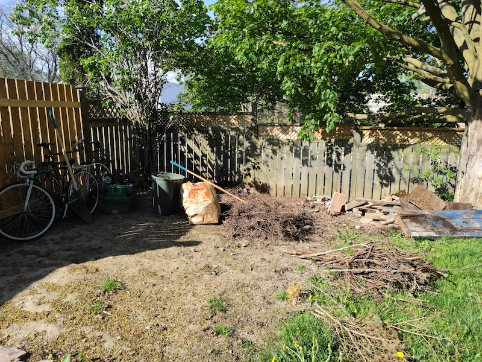

This spring I built an open-faced shed in our yard, primarily as a convenient shelter to store out bikes.
<!--more-->

## Motivation

<figure class="half">
    
    
</figure>

We moved into a new house in early spring. Our backyard was an absolute disaster, including a massive garbage/brush pile in one corner. This is the corner that joins the end of our driveway and the streetside property line (we are on a corner lot). It is a perfect nook to fit a small shed. Plus, building the shed here offers a little more privacy from the street.

The finished shed is 4ftx10ft, and is about 7ft tall. It features a green, or living, roof, which come spring will be complete with an array of local greenery. 

All in the project cost a few hundred dollars, though unfortunately I don't have a detailed breakdown. Most of the build was completed late spring/early summer 2020. Lumber prices had begun to rise and availability was an issue at times, but not as crazy as late 2020 - thankfully.

## Laying the foundation
The soil here is hard clay, and the location slopes gently parallel to the fenceline. For simplicity, and because this is just a shed, I decided to use a skid foundation. This consists of three treated 10ft 4x4's (skids) laying directly on the ground. A layer of stone/rock under each skid helps to remove moisture from the wood foundation (despite the skids being treated, prolonged direct contant with the wet soil will eventually rot the wood).

A skid foundation is simple and easy to build, but it is also susceptibile to heaving from frost. Re-level the skids after a particularly eventful spring is not *too* big of a job, though.

<figure class="align-center">
    
</figure>

First I had to dig out the site to get it close to level. It is crucial that the skids are as close to level as possible, and the easiest way to acheive this is to make the ground level. I then layed three trenchs filled with small gravel and stone, all of which I removed from my flower beds (a story for another time).

<figure class="half">
    
    
</figure>

The base frame sits directly on the three skids. It's built from PT 2x6's. The decking is simply 3/4" PT ply.

## ~~4~~ 3 walls...

I wanted to keep the front of the shed completely open, so I needed two 4ft side walls and a single 10ft rear wall. There were a couple factors that went into determining the the shed height. First, I wanted the enterance to the shed to be high enough such that I didn't need to worry about smashing my head (I'm no shorty, peaking out around 6'2"). Second, the slope of the roof needed to be relatively small, for future green-thumb reasons. I settles on a wall height of 6ft. This would be the same for both side walls and the rear wall. The front entereance woud be lifted by 6 inches, for a clearance of 6'6" - enough buffer for my head. This is a roof slope of 6" over 4', or 1.5:12, or 12.5%... or about 7 degrees. 
<figure class="align-right">
    
</figure>
Excellent.

I used untreated framing lumber for the frame. It is mostly protected from the elements, and is elevated off the ground, which should offer enough protection against moisture and decay. 

The framing will be visible so I spaced the studs symmetrically along the back wall. This required more cuts for the siding since I couln't use stock lumber lengths. All-in-all I only had to buy a couple extra pieces and I think it was worth it for the symmetry!

<figure class="half">
    
    
</figure>

I secured the frame to the based with screws along the base plate. I leveled and squared each side and held them temporarily in place with some cross-bracing. Eventually these would be removed when the siding went up.

<figure class="align-center">
        
</figure>

The front of the shed is framed by two treated 4x4's. These are 6'6" tall and the header sits directly atop them. I made the header by laminating two treated 2x6's. The span is 10ft, which may be a little large given the future roof load. In the winter, when there is significant snow loads, I slip in a third 4x4 support in the middle. This is mostly just precautionary. In the future I may try to beaf up the header, or make the center post permanent.

## ...and a roof
While the footprint of the shed is 4ftx10ft, the roof is 6ftx12ft, to give about a foot of overhang on each side. First I cut all the rafters to length and angle. Then I knotched out a pair of birdmouth cuts on each so they could sit flush on the rearwall top plate and header. I used 2x4's for the rafters since the span isn't very long. I made a bare-bones frame on the ground, hoisted it into place (working on my lonesome, so this had to be light), and assembled the remaining rafters in place.

<figure class="third">
    
    
    
</figure>

Rafters were spaced symmetrically, ensuring proper alignment with the roof sheathing. I used three sections of 4'x6' 1/2" treated ply for the roof, so rafters had to fall at 48" and 96" centers.

<figure class="half">
    
    
</figure>

I added an 8" facer around the perimeter of the roof. This both serves as a sidewall for the future roof-top fun, and cleans up the exterior look of the roof line. You can see in the picture below that I shaved off the end of the facer side boards so that they met flush with the top of the front boards.

<figure class="align-left">
    
</figure>

The future fun I have planned for this shed is a green living roof. The top will be filled with top soil and various local grassed, shrubs, flowers, etc. The completion of the green roof will be covered in another post, but for now you can see how the facer board enclosed the roof-top. From here a waterproof membrane will be layed, followed by garden fabric and topsoil. Most green roofs recommend a few inches depth to provided adequate root binding. The 8" facer gives a 3-4" depth, which should be perfect.
 
 

## Siding

The siding for the shed is super simple. I didn't want sheath the entirety in OSB, then side the exterior with a facade. I don't like the look, and since the shed is not weatherproof by design, there is no need. I wanted a simple siding that adds some character. I opted to use 1x6 treated fence boards that I mounted horizontally.

<figure class="third">
    
    
    
</figure>

My local lumber store stocked 5ft boards, which was perfect for the rear wall (10ft in length). I trimmed the seams with vertical boards. I really like this finished look. 

<figure class="align-right">
    
</figure>

For the sides I just had to cut to length as there were no 4ft or 8ft boards available. This left a little waste, but it was pretty minimal, plus I made use of some of it by making some planter rack for the sides. I used two 1ft offcuts for the face, and trimmed a few small pieces as spacers from the shed sides. These little guys work perfect for hanging planters - the type you would hang from a railing. Hopefully next summer we will get some herbs in here.

As the siding boards dried and shrank, small gaps formed between the boards. Not big enough for rain or snow to get through, but large enough that you can see slits of light. I think it works with the overall style of the shed. And again, it is open faced, so it's not like the thing was weather proof to start.

## Done for now

That concludes the main build of the shed. So far it has treated us well and has been used quite a lot. It has also stood it's ground against some pretty fierce storms.

<figure class="half">
    
    
</figure>

Next spring I'll be finishing off the roof by planting some greenery. It should be an interesting addition to the project. There will be more details and pictures when that happens.

