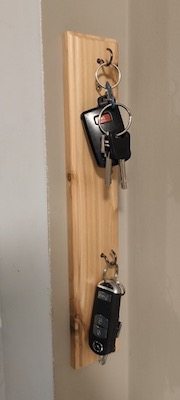
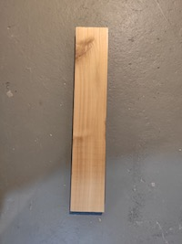
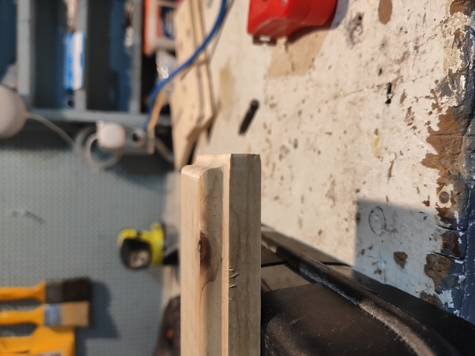
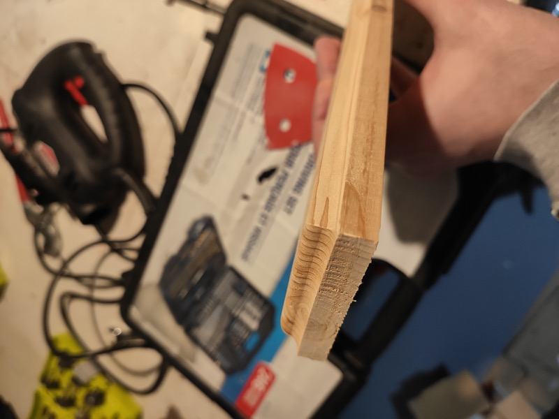
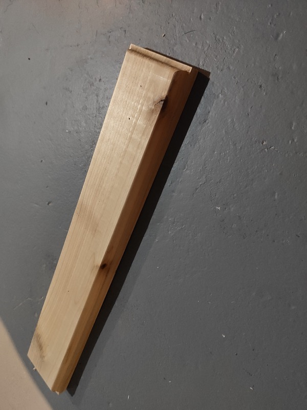
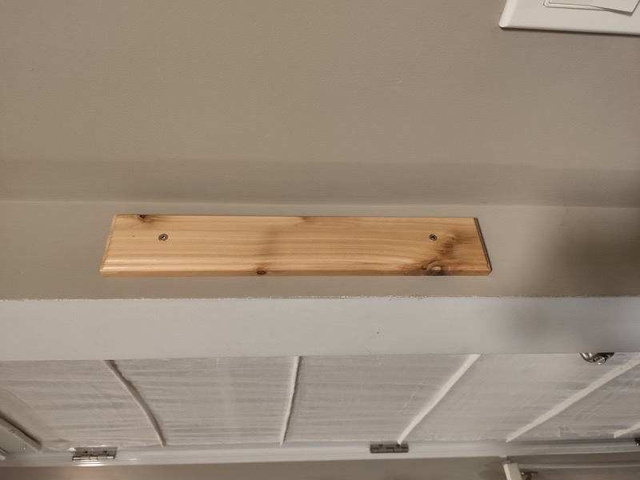
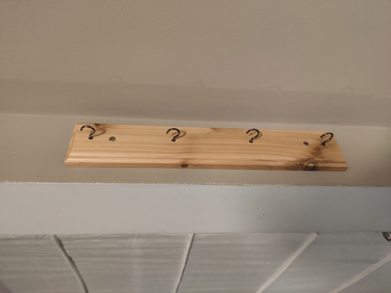
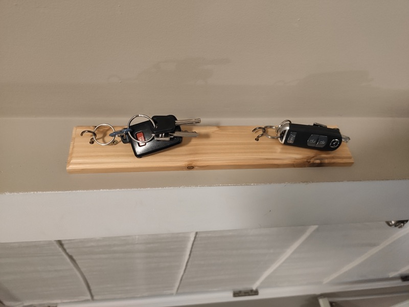
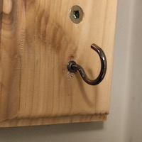

<figure class="align-center">
        
</figure>

This was a quick and simple project to add a key rack by our main entrance. There's not a lot of space at our side door (our most heavily used door) and no place to put even a small key rack. There is however a 6" beam directly beside the entrance. I thought a small vertical key rack could fit here nicely. 

The rack is made from some scrap cedar I had lying around. I finished it with some water based varathane. The hooks are simple cup hooks. The hole process could be summazied by: 1. find piece of wood, 2. screw hooks said wood. But why not, let go into excessive detail.

<figure class="align-right">
    
</figure>

I started by measuring our keys.... since they will hang vertically there is the potential to block lower hooks if they are spaced too closely. I found that a 4" separation would probably work. For a 4-hook rack that's 3x4" plus an inch on each end for a total of about 14" in length. I cut this from stock 1"x3" cedar.

To add a little *pizazz* I used a router to edge the piece. Also, this is the only thing that differentiates the piece from simply a strategically cut chunk of wood. I used an ogee bit (those s-shaped ones) with ~1/4" diameter to give this nice rounded finish. Very regal. Very fancy.

<figure class="third">
    
    
    
</figure>

While I personally like the look and feel of the unfinished cedar, I decided to protect it with two  coats of water based varathane. This will help avoid scratch and just protect it a little (protect from what I do not know). I prepped by sanding the face to 220 grit with a detail sander. I carefully sanded the edges by hand. Two coats of varathane sealer and we're done. 

At this point I had not bought the hooks yet, so I just marked out their locations and mounted the rack. I predrilled and countersunk the screw holes and mounted the rack directly into a stud - not that it is needed for this, anchors would be fine, it was just coincidence with the mounting location.

<figure class="third">
    
    
    
</figure>

The hooks were the only thing I purchased directly for this project. They were $2.50 from HD. I went for the darker antique finish, just 'cause. As I said I had pre-marked the locations, so finishing this was as simple as screwing in the hooks. 

<figure class="align-right">
    
</figure>

Protip: predrill hole for this type of delicate hook - even in a soft wood such as cedar. One of the hooks hit a knot and I broke it off trying to screw it in. Luckily I was able to drill and mount a replacement directly beside the broken stub and it is concealed pretty well.  But just avoid this possibility and pre drill.

So far the rack has performing honourably, and we no longer have to rifle through a drawer to find our keys!

